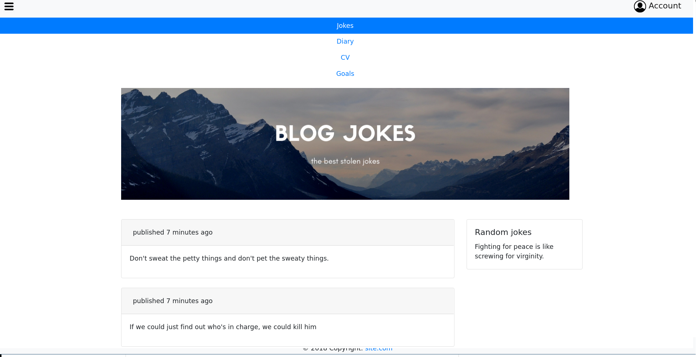
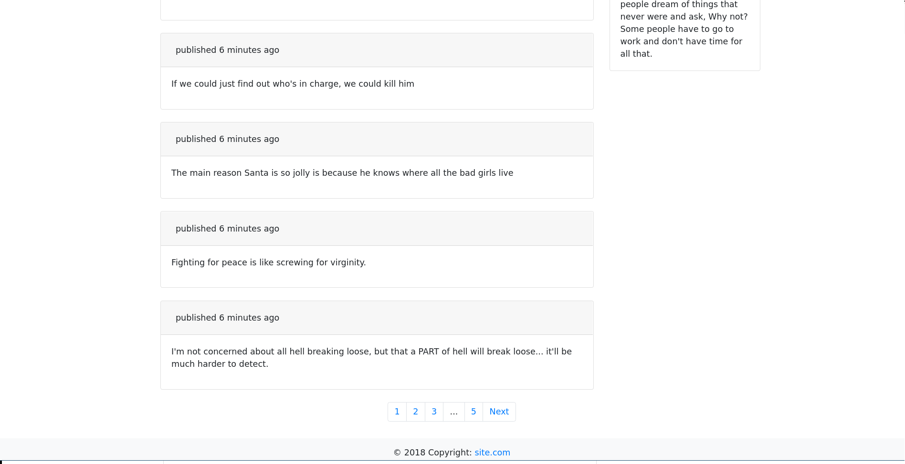
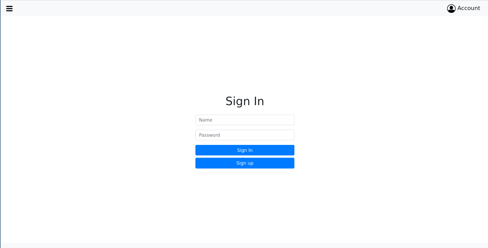

# blog

<!---#<h2>Overwiew</h2>-->
<!---#<h6><h6>-->

<h2>Frameworks and tools</h2>

<h6>
    Java&IDE: JDK8 MyEclipse2018 
    Backend: Spring-boot, Spring, Spring-data, Spring Security, apache POI, Hibernate 
    Frontend: Bootstrap, thymeleaf 
    Database: cassandra 
    Web Server: Tomcat 
    Build Tool: Maven 
    Linux： Arch Linux 
    Other: Log4j, junit, lombok 
</h6>

<h2>Tuning project...</h2>

<h6>
    <ol>
        <li>Add libraries to build path. In Eclipse: right click by folder "library" and choose "Add to Build Path"
        </li>
     <li>If you can't start project from of weakly computer you can delete package "com.web.blog.Initializing" </li> 
        <li>If you can't start project then execute command "Drop keyspace blog;" in cassandra </li> 
        <li>If you can't start project then change schemaAction.RECREATE to another recreate RECREATE_.. in class CassandraConfiguration in package "com.web.blog.configuration" </li> 
          <li>If you want start project without mistakes then change schemaAction to "CREATE_IF_NOT_EXISTS" in class configurationCassandra and delete package Initizator </li> 
   </ol>
</h6>

<h2>Username, password and role for sign In</h2>

<h6>
    <ol>
        <li>Admin: 123 :admin</li>
        <li>User: 123 :user</li>
        <li>Banan: 1234 :user</li>
        <li>nonBanan: 12345 :user</li>
   </ol>
</h6>

<h2>How use cassandra</h2>

Open cassandra in terminal
            
    cqlsh
    
Show all exist databases

    DESCRIBE keyspaces;
    
Use database "blog"
    
    use blog
  
Show all tables
    
    DESCRIBE tables;
    
Select all from table "jokes"
    
    SELECT * FROm jokes;

Drop table
    
    DROP TABLE jokes;
    
Drop database

    drop keyspace blog;
    
To clear table "goals"

    TRUNCATE goals;
    
<h2>Screenshots</h2>
<kbd></kbd>
<kbd></kbd>
<kbd></kbd>

